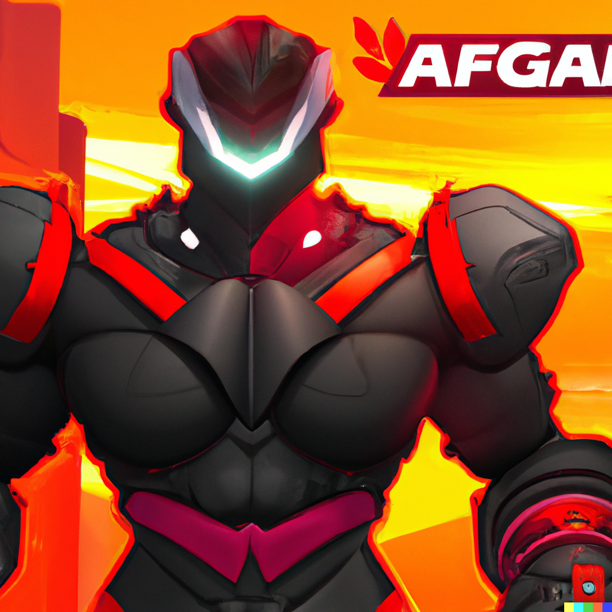

# Hello World
This is my new webpage

## Write a hype promo for an Apex Legends new hero release.

Introducing Apex Legends' newest hero: Forge! With an impressive array of weaponry and an indomitable spirit, Forge is ready to take the Apex Games by storm. This powerful brawler is a master of the battlefield, able to take on any opponent with his superhuman strength and agility. He comes equipped with a variety of weapons including a powerful shotgun, an energy shield, and a special grappling hook. Plus, he brings a unique set of abilities to the game that are sure to give you an edge in the fight. Get ready to take your Apex Legends game to the next level with Forge!

## More info on Forge.

Forge is a brawler who brings a unique set of abilities to the Apex Games. He's a master of the battlefield with superhuman strength, speed, and agility. He has a powerful shotgun, energy shield, and a special grappling hook. His abilities allow him to take on any opponent and come out on top. He also has the ability to create a protective shield, which will keep him safe from incoming attacks. With Forge in your squad, you can be sure that your victories will always be epic!

## Image of Forge.
 

Forge has a powerful physique, with a broad chest and muscular arms. His outfit is a blend of black and red with a robotic-inspired design. His face is hidden behind a metallic mask, but his eyes blaze with determination. He has a determined look that shows he's ready to take on any challenge that comes his way. His powerful stance and weapons make him a formidable opponent on the battlefield. As the newest hero of Apex Legends, Forge is sure to be a powerful asset to any team!

Forge's passive ability and ultimate. 

Forge's passive ability is called Kinetic Absorption. It allows him to absorb kinetic energy from incoming attacks, turning it into a shield that will protect him from damage. His ultimate ability is called Hammer Down Protocol. When activated, it sends a massive shockwave that will knock back enemies and deal damage. It's a powerful ability that can easily turn the tide of battle in your favor.

Are you ready to join Forge in the Apex Games? Download Apex Legends now and get ready for a thrilling battle!

Write a hype promo for an New Apex Legends season and map release.

The newest Apex Legends season is here and it's bigger and better than ever! Get ready for explosive action with the introduction of a brand-new map, World's Edge. This massive environment is filled with all sorts of terrain, from lush jungles to icy tundras. You'll find yourself exploring new areas and uncovering hidden secrets as you battle your way to the top.

Plus, this season brings all sorts of new content, including new characters, weapons, and items. You'll be able to customize your character to your heart's content, with a wide selection of skins, emotes, and more. And, if you're looking for more ways to show your Apex pride, you can now purchase new banners and banners frames.

On top of all that, you'll find a ton of new challenges to complete. You'll be rewarded with exclusive rewards for completing daily and weekly challenges. With so much to do, you'll never get bored in Apex Legends. 

So, what are you waiting for? Join the fight and experience the new Apex Legends season for yourself! Download Apex Legends now and experience the ultimate battle royale experience.

Hype new promo for a new Apex Legends weapon.

Introducing the newest weapon to join the Apex Legends arsenal: the Mastiff Shotgun! This powerful shotgun packs a punch, making it the perfect choice for close-quarter combat. With its high rate of fire and wide spread, the Mastiff Shotgun can take out multiple enemies in a single blast. It also has a unique feature that allows it to reload quickly after each shot, giving you an edge in a fight.

The Mastiff Shotgun is perfect for those who like to get up close and personal with their enemies. With its high damage output and fast reload speed, it's sure to make an impact on the battlefield. Plus, it's easy to handle, even for newcomers to Apex Legends. So, whether you're a seasoned veteran or a new player, you'll be sure to dominate the competition with the Mastiff Shotgun.

Ready to take your Apex Legends game to the next level? Download Apex Legends now and get your hands on the Mastiff Shotgun!
